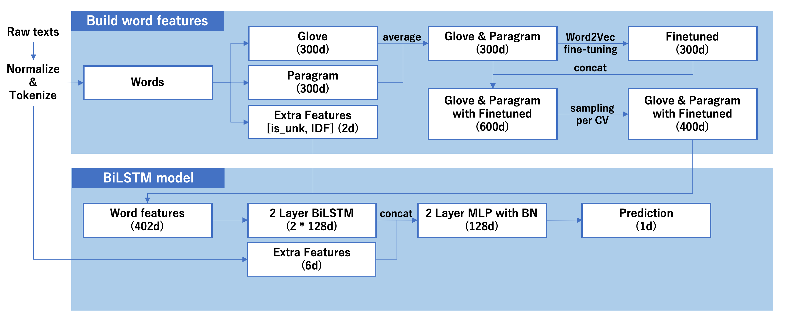

# Quora Insincere Questions Classification

[](https://circleci.com/gh/k-fujikawa/Kaggle-Quora-Insincere-Questions-Classification)

4th Place Solution for [Quora Insincere Questions Classification](https://www.kaggle.com/c/quora-insincere-questions-classification)

Solution overview is as below:



## Requirement

- docker >= 17.12.0
- docker-compose >= 1.19.0
- nvidia-docker2 >= 2.0.2

## Getting started

### :beginner: Setup

#### Setup kaggle API credentials

Download kaggle.json and place in the location: `~/.kaggle/kaggle.json`.  
See details: https://github.com/Kaggle/kaggle-api

#### Build Docker image

```
docker-compose build
```

#### Download and unzip competition datasets

```
docker-compose run cpu kaggle competitions download quora-insincere-questions-classification -p input
unzip "input/*.zip" -d input
```

### :rocket: Train model

#### Train with GPU

```
docker-compose run gpu python exec/train.py -m python exec/train.py -m models/submit/submit1_embed_smpl_400.py -g <GPU_ID>
```

#### Train with CPU

```
docker-compose run cpu python exec/train.py -m python exec/train.py -m models/submit/submit1_embed_smpl_400.py
```

## Contribution

Below command will run both `flake8` and `pytest`:
```
$ docker-compose run test
```

### Coding Guidelines

We use [PEP8](https://pep8-ja.readthedocs.io/ja/latest/) syntax conventions, so please check your python changes:

```
$ docker-compose run cpu flake8
```

### Testing

Before sending your PR, please make sure all tests are passing:

```
$ docker-compose run cpu nosetests
```
